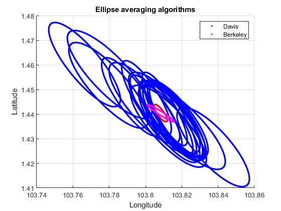

# ellipseRoutines
MATLAB routines for ellipse and geolocation-related algorithms. Sample code can be found in ***demo_ellipseRoutines.m***.

## Ellipse averaging
Given a set of geolocation points, defined by confidence ellipses, we want to combine these ellipses in a mathematically sensible fashion to produce a more confident estimate. For the mathematics behind the different formulations, please refer to *Combining Error Ellipses*, Davis J.E. (2007) and *Data Analysis Toolkit 12: Weighted averages and their uncertainties*, Kirchner J (2006). A walkthrough is given [here](https://github.com/car-engine/pydsproutines/blob/master/EllipticalDistributionsAndCombinations.ipynb).

```matlab
% Load toy ellipse data
load('gl_ellipses.mat')
mu = gl_ellipses(:,[1 2]); % long lat
major = gl_ellipses(:,3);
minor = gl_ellipses(:,4);
angles = gl_ellipses(:,5);

% Perform ellipse averaging
[mu_weighted_mean, sigma_davis, sigma_berkeley] = averageEllipses(mu, major, minor, angles);
[davis_major, davis_minor, davis_angle] = convertCovarianceToAxes(sigma_davis); % output major and minor are already in degrees
[berkeley_major, berkeley_minor, berkeley_angle] = convertCovarianceToAxes(sigma_berkeley); % output major and minor are already in degrees

% Initial ellipses
% Convert major (long) and minor (lat) to LL units
% Note: convertDisttoLL only properly does the conversion along a fixed latitude/longitude - distances at angles dont make sense as 1 degree lat != 1 degree long
% Here, our semi-major/minor axes are at an angle - we have neglected this and arbitrarily chosen to convert the semi-major along the longitude and semi-minor along the latitude
% For the error ellipse sizes we are working with, the error is small
[major_degress, minor_degrees] = convertDisttoLL(major, minor, mu(:,2));
[x_initial, y_initial] = generateEllipsePoints(mu(:,1), mu(:,2), major_degrees, minor_degrees, angles);

% Averaged ellipses
[x_davis, y_davis] = generateEllipsePoints(mu_weighted_mean(1), mu_weighted_mean(2), davis_major, davis_minor, davis_angle);
[x_berkeley, y_berkeley] = generateEllipsePoints(mu_weighted_mean(1), mu_weighted_mean(2), berkeley_major, berkeley_minor, berkeley_angle);

% Plot
figure; hold on; grid on; xlabel('Longitude'); ylabel('Latitude'); title('Ellipse averaging algorithms'); legend;
plot(x_initial, y_initial, 'b.', 'DisplayName', 'Initial', 'HandleVisibility','off');
plot(x_davis, y_davis, 'r.', 'DisplayName', 'Davis');
plot(x_berkeley, y_berkeley, 'm.','DisplayName', 'Berkeley');
```


## Heatmap generation using geolocation ellipses
Given a set of geolocation points defined by cofidence ellipses, we want to generate a heatmap to determine the likely transmitter locations. The following computes the cumulative distribution function of the Gaussian distribution associated with each ellipse, for each grid point, to generate the heatmap.

```matlab
% Load toy ellipse data
load('gl_ellipses.mat')

% Define number of bins and latitude, longitude bounds
nBins = [1000 1000];
rangeBins = [103 104; 1 2]; % [long; lat]

% Generate heatmap
heatmap2D_Gaussian = heatmap2Dpdf_Gaussian(gl_ellipses, nBins, rangeBins);

% Plot heatmap;
figure; hold on; grid on; xlabel('Longitude'); ylabel('Latitude'); title('Gaussian heatmap');
heatmap2D_handle = plotHeatmap2D(heatmap2D_Gaussian, rangeBins(1,:), rangeBins(2,:));
xlim([103.6 103.95]); ylim([1.3 1.65]);
```


We can also compare the results from ellipse averaging and Gaussian heatmap
```matlab
figure; hold on; grid on; xlabel('Longitude'); ylabel('Latitude'); title('Comparison of ellipse averaging and Gaussian heatmap'); legend;

% Plot averaged ellipses
plot(x_davis, y_davis, 'r.', 'DisplayName', 'Davis');
plot(x_berkeley, y_berkeley, 'm.','DisplayName', 'Berkeley');

% Plot heatmap
heatmap2D_handle = plotHeatmap2D(heatmap2D_Gaussian, rangeBins(1,:), rangeBins(2,:));
uistack(heatmap2D_handle,'bottom');
xlim([103.74 103.88]); ylim([1.38 1.52]);
```
